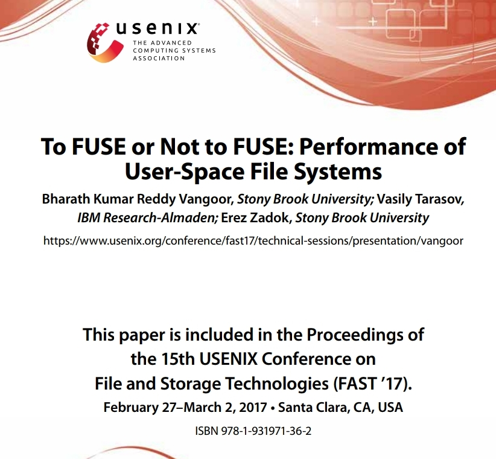 

일주일에 논문 한 편은 읽자고 마음먹은 후 첫 번째로 뽑은 논문이다. FUSE에 대해 개념은 대충 들어 알고 있다고 생각했지만, 자세히 알아보려고 FUSE Project 홈페이지에 갔더니, FUSE에 대해 자세히 알려면 코드를 읽든가 아니면 이 논문을 추천한다고 해서 고르게 되었다. 

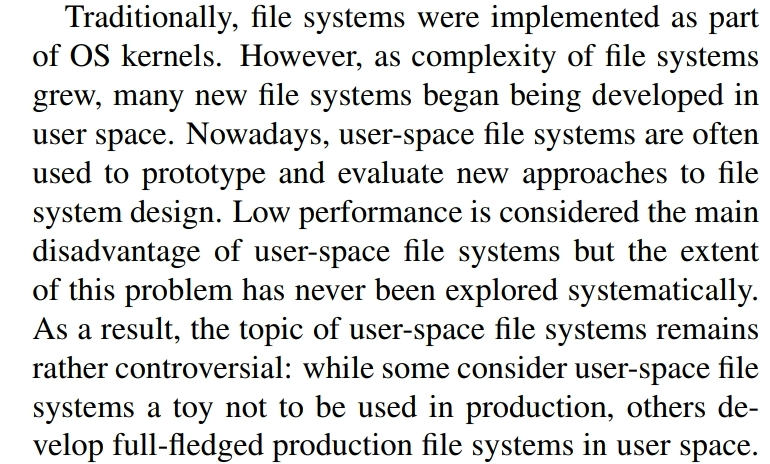

파일시스템은 전통적으로 커널에 구현되어 있었지만, FUSE 라는 것이 나와서 파일시스템 로직을 Userspace에서 구현할 수 있게 되었다. 그러다 보니 FUSE로 많은 파일시스템이 구현되었는데, 혹자는 이것이 그저 toy program혹은 prototype 용이라고 하고, 다른 이들은 production에서도 쓸 만하다고 한다. 그 차이를 나누는 주요한 이슈는 성능이고, 이 논문은 다양한 환경과 워크로드에서 FUSE의 성능을 측정해 보고, instrumentation을 통해 병목이 어디인지 찾으려고 한다. 

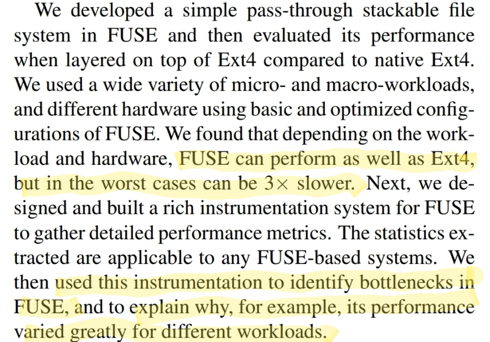

리눅스 기본 파일시스템인 Ext4 와 비슷한 성능을 보여주기도 하지만, 최악의 경우에는 3배쯤 느릴 수 있다. 

일단 FUSE가 무엇인지, 어떤 구조를 가지고 있는지 다음 그림을 살펴보자. 

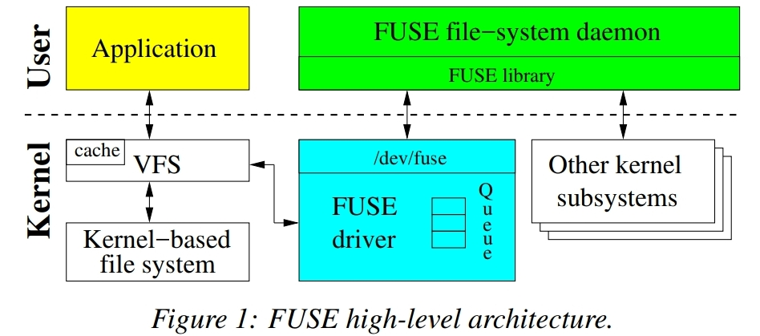

Application 들은 파일시스템과 직접 얘기하는 것이 아니라 [VFS](https://en.wikipedia.org/wiki/Virtual_file_system)라는 인터페이스를 통한다. 따라서 파일시스템 구현들은 [VFS](https://en.wikipedia.org/wiki/Virtual_file_system)가 정의하는 인터페이스를 구현한다. 따라서 위 그림과 같이, FUSE는 FUSE Driver가 커널모듈 형태로 존재하고, FUSE driver는 file system request 들을 user space에 있는 FUSE file system 구현체에게 전달하는 역할을 한다. FUSE가 지원하는 request의 종류는 다음과 같다.

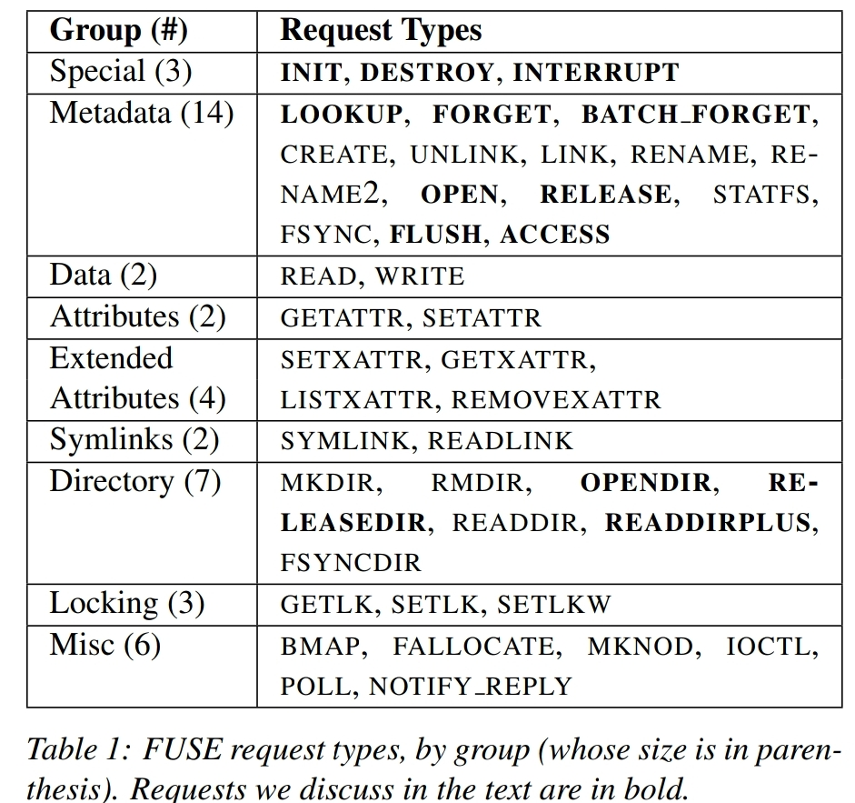

이 논문에서는 굵은 글씨로 표시된 것들만 자세히 설명하고 있다. 나머지는 VFS와 다르지 않은 의미를 가지고 있다. 특히 Permission 부분이 인상적이었는데, 

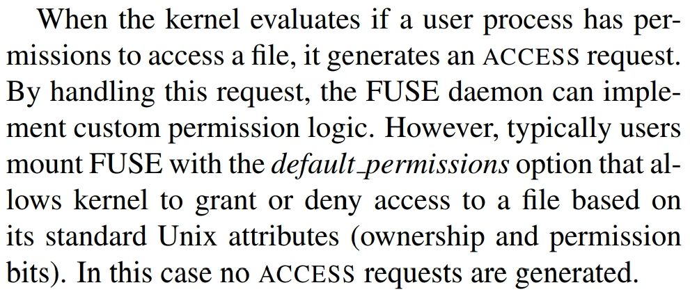

`ACCESS` request 를 처리하면 custom permission 로직을 구현할 수 있다. 예를 들어 분산시스템 환경에서 별도의 권한 및 접근 관리를 제공하는 서비스가 있다면, 이 부분을 이용할 수 있을 것이다. 물론 보통은 `default_permissions` 옵션을 이용해서 마운트 하게 되는데, 이때는 통상적인 Unix 의 permission 시스템을 따르게 된다. 

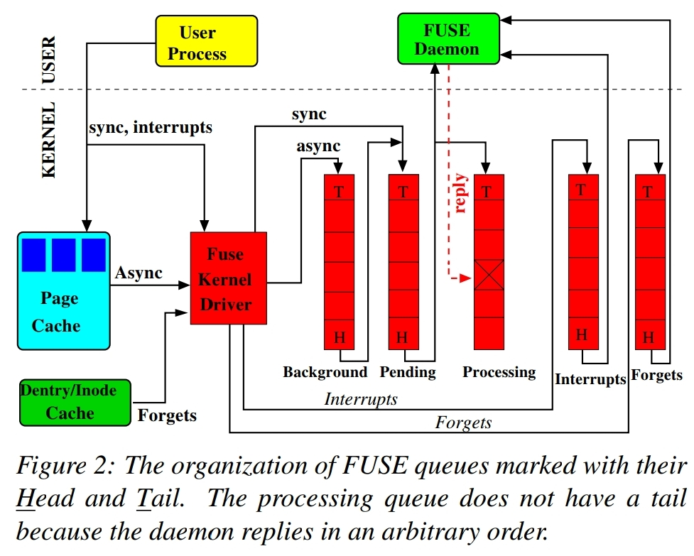

FUSE kernel driver는 request들을 queue에 넣어 관리하는데, 총 5개의 queue가 있다. 

성능에 대해서 조금만 생각해 본 적이 있다면 알겠지만, kernel와 user space 간에 memory copy 가 발생하면 성능이 떨어질 수 밖에 없다. 따라서 FUSE에서는 kernel의 [splicing](https://en.wikipedia.org/wiki/Splice_(system_call)) 이라는 기능을 사용하여 memory copy를 줄인다. 

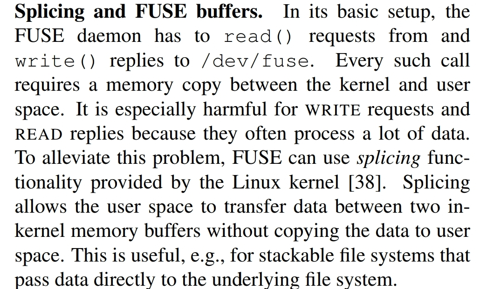

또 다른 write 성능 개선을 위한 방법. write-back cache를 사용하고, 한꺼번에 여러개의 블록을 FUSE daemon 에 보내도록 했다. 

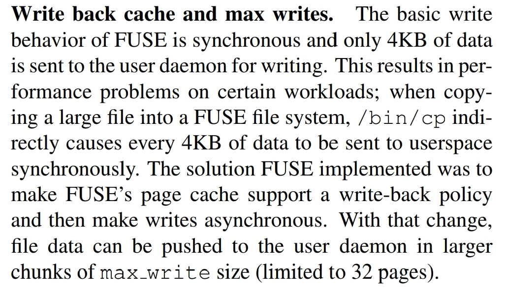

여기까지는 FUSE 에 대한 소개였고, 이제 논문의 목적인 성능 측정을 하기 위해 Stackfs라는 것을 만들었다. Stackfs는 간단한 stackable passthrough file system으로, Ext4 위에서 request들을 그대로 전달하는 기능만을 가지고 있다고 생각하면 될 것 같다. 또한 (자세한 성능 측정을 위해) FUSE kernel module과 user-space library에 instrumentation도 추가했다. 

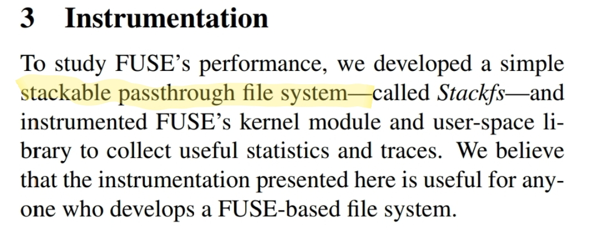

조금 더 자세한 설명: 왜 Stackfs 를 (그렇게) 만들었나? (1) 대부분의 FUSE 기반 파일시스템이 stackable file system이었다 (2) FUSE의 kernel과 라이브러리가 더하는 오버헤드를 측정하고 싶었다. 

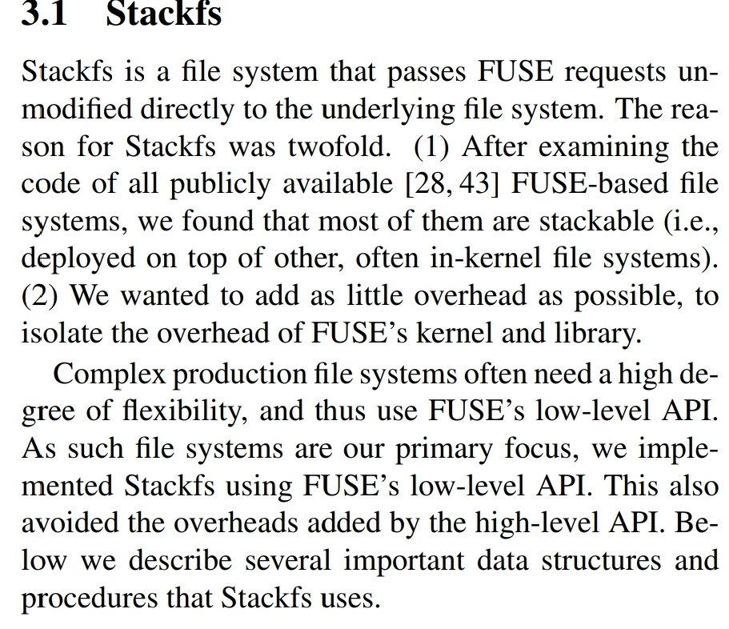

FUSE의 성능이 좋지 않다는 편견이 많은데, 저자들은 그것이 최적화가 적용되지 않은 옛날 버전에 대한 것이라고 생각했던 것 같다. 그래도 최적화가 적용되지 않은 버전과 적용된 버전 두 가지를 준비해서 실험했다. 

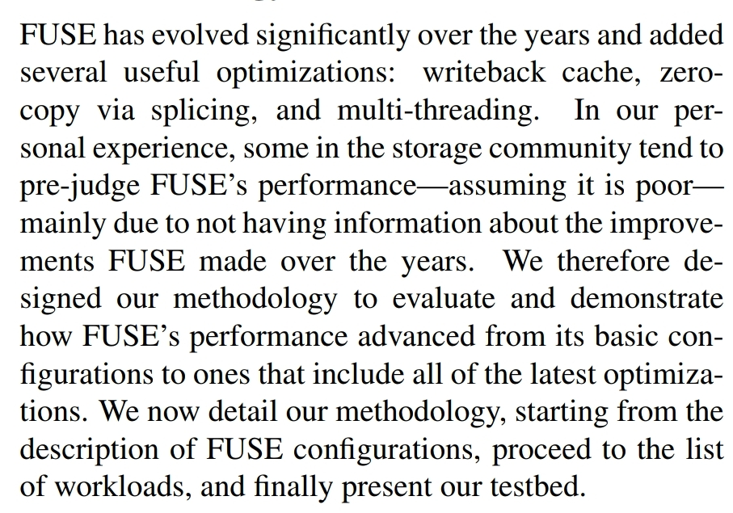

